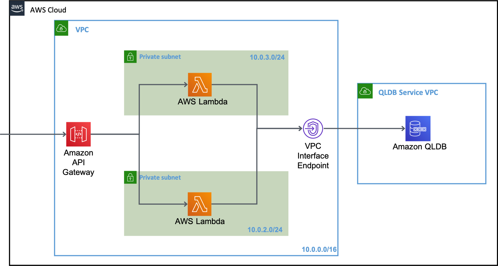

## Securely Access QLDB from a Private Subnet

This `qldb-vpc` demo is provided to demonstrate how to securely access QLDB from instances deployed in a private subnet in a customer VPC, with no internet access. All traffic that is routed from the `AWS Lambda` function to QLDB and back remains on the AWS network.

The basic architecture overview of the application is shown below:



## Run the demo

The demo sets up a new VPC and two private subnets. You may need to change the CIDR range assigned to the VPC to prevent any clashes.

Use the following commands to run the demo.

``` bash
npm ci
npm run sls -- deploy --stage {stage-name}
```

When successfully deployed, the POST endpoint will be returned.

curl -X POST -H "Content-Type: application/json" \
    -d '{"firstName": "Matt", "lastName": "Lewis"}' \
    <POST-Endpoint>

This will return the docId of the new inserted document.